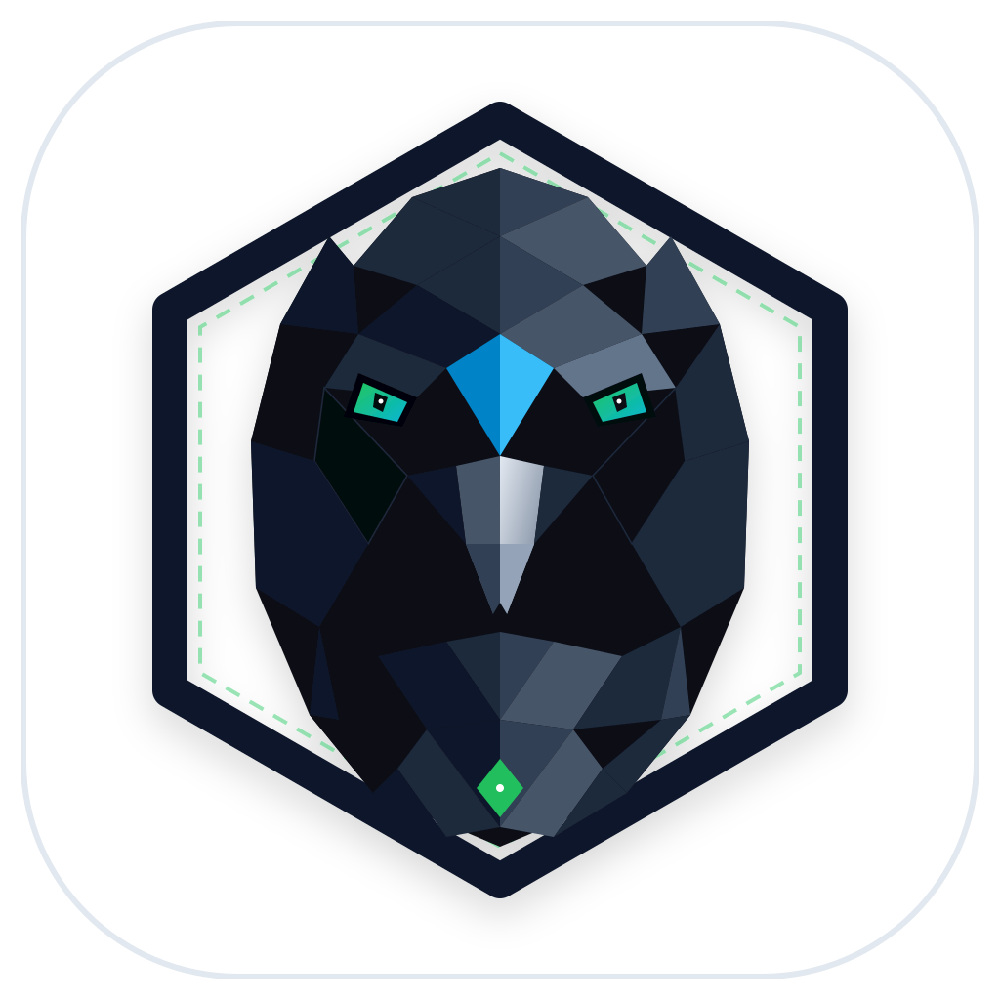
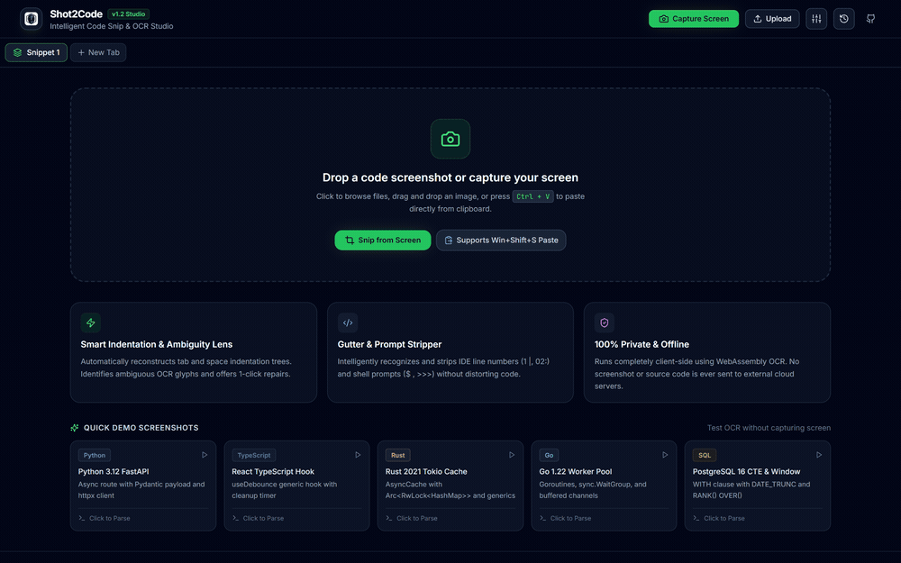
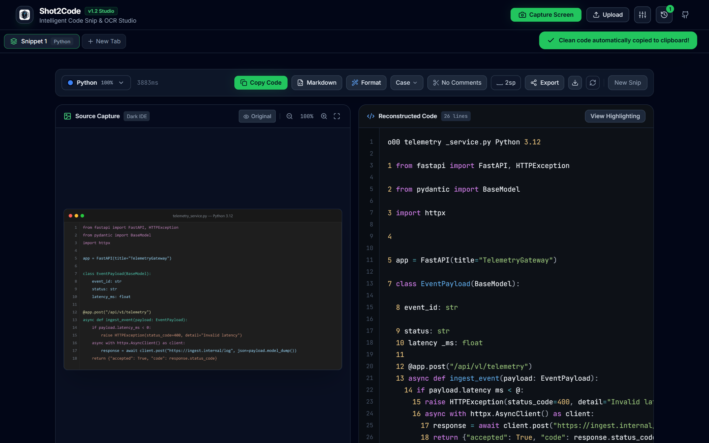

<p align="center">
  <a href="https://github.com/alexandrmotologa/shot2code">
    
  </a>
</p>

<h1 align="center">Shot2Code</h1>

<p align="center">
  <strong>Intelligent code snip and WebAssembly OCR studio for developers.</strong>
</p>

<p align="center">
  <a href="#overview">Overview</a> •
  <a href="#interactive-demo">Interactive Demo</a> •
  <a href="#capabilities">Capabilities</a> •
  <a href="#screenshots">Screenshots</a> •
  <a href="#supported-languages">Languages</a> •
  <a href="#quick-start">Quick Start</a> •
  <a href="docs/architecture.md">Architecture</a> •
  <a href="LICENSE">License</a>
</p>

<p align="center">
  
  
  
  
  
</p>

<br />

<p align="center">
  
</p>

<br />

## Overview

Shot2Code is a desktop and browser developer utility that converts code screenshots into clean, formatted text. It extracts code from video tutorials, conference livestreams, webinars, PDFs, and documentation where direct text selection is disabled. 

The processing pipeline runs an in-memory WebAssembly OCR worker, repairs broken indentation, removes OCR artifacts, and formats the output for immediate use in your editor. All recognition runs locally on your machine without external cloud dependencies.

## Capabilities

- **Browser and desktop modes:** Run directly in any modern browser using the HTML5 Screen Capture API (`getDisplayMedia`) or as a native desktop application with global system shortcuts via Tauri 2.0.
- **Direct clipboard paste:** Press `Ctrl+V` (or `Cmd+V`) anywhere in the application to parse screenshots taken with the Windows Snipping Tool (`Win+Shift+S`) or macOS screenshot shortcuts without saving intermediate image files.
- **Theme preprocessor:** Detects dark theme backgrounds, inverts pixel values to dark text on pure white for higher recognition accuracy, applies contrast filters, and scales images by 2x to preserve colons, semicolons, and subtle punctuation.
- **Gutter and prompt stripping:** Automatically detects and strips IDE line number columns (`1 |`, `02:`, `15 `) and terminal prompts (`$ `, `>>> `, `> `) without shifting line indentation.
- **Syntactic indentation reconstruction:** Rebuilds space and tab hierarchies based on block scope markers, curly braces, and language keywords.
- **Ambiguity lens:** Scans recognized text for common OCR character substitutions (such as `|` vs `l`, numeric `0` in identifiers, and unclosed brackets) and provides 1-click repairs.
- **In-browser code formatting:** Standardizes indentation (2 vs 4 spaces), operator spacing, and identifier casing (`camelCase`, `snake_case`, `PascalCase`, `CONSTANT_CASE`).
- **Multi-snippet workspace:** Organize captures across parallel tabs and merge them into a single documented source file with one click.
- **One-click presentation exports:** Send snippets directly to Ray.so or Carbon, or publish anonymous GitHub Gists.
- **Optional AI syntax polish:** Client-side BYOK integration supporting Gemini 1.5 Flash, OpenAI, Claude, or local Ollama instances for low-resolution 720p video screenshots.
- **Zero server dependencies:** The core OCR engine runs entirely client-side using Tesseract WebAssembly. Your screenshots and code never leave your machine.

## Screenshots

### Studio Split View
Side-by-side verification with synchronized zoom, original vs inverted preprocessing, ambiguity glyph highlighting, and multi-tab snippets:

<p align="center">
  
</p>

### Workspace and Quick Presets
Direct screen snip, system clipboard paste (`Ctrl+V`), drag-and-drop ingestion, and built-in multi-language sample presets:

<p align="center">
  
</p>

## Supported Languages

Shot2Code includes automated syntax detection, heuristic cleanup, and highlighting for:

| Language | File Extension | Syntax Highlighting | Indentation Repair |
| :--- | :--- | :--- | :--- |
| Python | `.py` | Yes | Indentation & colon scope |
| TypeScript | `.ts` | Yes | Bracket hierarchy & types |
| JavaScript | `.js` | Yes | Bracket hierarchy |
| Rust | `.rs` | Yes | Lifetime annotations & braces |
| Go | `.go` | Yes | Goroutines, channels & structs |
| SQL | `.sql` | Yes | CTEs, queries & keywords |
| HTML | `.html` | Yes | Tag pairing & attributes |
| CSS | `.css` | Yes | Declarations & media queries |
| C++ | `.cpp` | Yes | Pointers & template syntax |
| Shell / Bash | `.sh` | Yes | Prompts, flags & pipes |
| JSON | `.json` | Yes | Key-value pairs & commas |

## Quick Start

### Prerequisites

- Node.js 18 or later
- npm 9 or later

### Installation

```bash
git clone https://github.com/alexandrmotologa/shot2code.git
cd shot2code
npm install
```

### Development Server

Start the local web studio:

```bash
npm run dev
```

Open `http://localhost:3000` (or the port indicated in the terminal) in your browser.

### Run Unit Tests

Execute the test suite covering the heuristics engine, ambiguity detector, and language scorer:

```bash
npm test
```

### Production Build

Compile the web application bundle:

```bash
npm run build
```

The output files are generated in the `dist/` directory.

## Desktop Shell (Tauri 2.0)

To build the native desktop application with global system shortcuts:

```bash
# Prerequisites: Rust toolchain installed (https://rustup.rs)
npm install -g @tauri-apps/cli
cargo tauri dev
```

## Documentation

- [Architecture Overview](docs/architecture.md): WebAssembly OCR workers, canvas filters, and state pipelines.
- [Heuristics Guide](docs/heuristics-guide.md): Indentation reconstruction, delimiter balancing, and symbol disambiguation tables.
- [Tauri Setup Guide](docs/tauri-setup.md): Native desktop configuration, global hotkeys, and release builds.
- [Contributing](docs/contributing.md): Contribution workflow and coding conventions.

## Brand Identity

The Shot2Code emblem depicts the **Peregrine Optical Falcon**, engineered following procedural geometric principles:
- **Optical Precision Eye:** Dual-concentric target lens representing real-time character boundary recognition.
- **Architectural Hexagon:** Heavy obsidian frame symbolising system stability and local desktop execution.
- **Telemetry Accents:** Emerald and cyan accents representing code accuracy and WebAssembly speed.

Vector assets are available in `docs/images/logo.svg` and `docs/images/logo.png`.

## License

MIT License. Copyright (c) 2026 alexandrmotologa.
